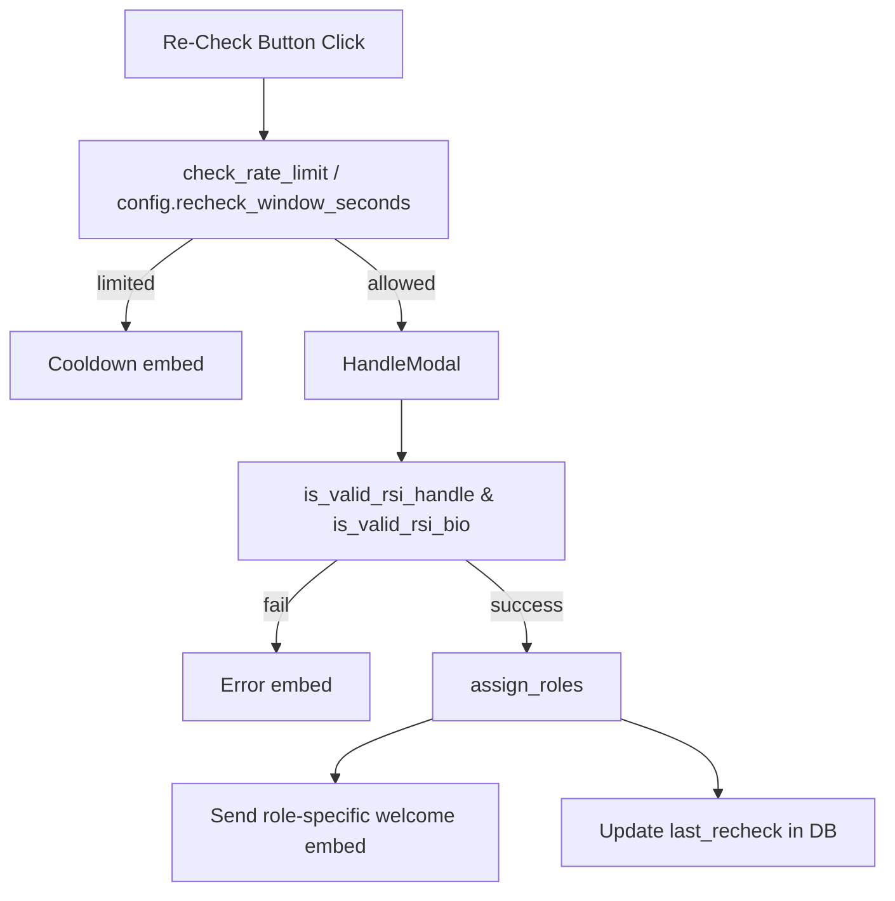

# Re-Check Feature Plan

This document outlines the planned enhancements required to add a **Re-Check** option for already verified members. It builds on the existing verification workflow described in `docs/verification_workflow.md`.

## 1. Required Enhancements

- **Cooldown Display**: Replace the plain-text countdown with `create_cooldown_embed` and `followup_send_message` so users see a consistent embed during cooldown periods.
- **Embed Factories**: Use `create_error_embed` and `create_success_embed` for all messages shown during the re-check process.
- **Welcome Embeds**: After a successful re-check, send role-specific welcome embeds: `main`, `affiliate`, and `non_member`.
- **Button ID**: Standardize the re-check button with the persistent ID `"verification_recheck_button"`.
- **Rate Limit Configuration**: Move the 300‑second cooldown into `config.yaml` as `rate_limits.recheck_window_seconds` (or rely on `check_rate_limit` if consolidated).
- **Database Migration**: Add a migration creating a new `last_recheck INTEGER DEFAULT 0` column in the `verification` table.

## 2. Implementation Plan

- **helpers/embeds.py**
  - Add helper functions for welcome embeds if not already present (e.g., `build_welcome_description`).
  - Ensure `create_cooldown_embed` is reused for the re-check flow.
- **helpers/views.py**
  - Introduce a new `RecheckView` or extend `VerificationView` with a re-check button using ID `verification_recheck_button`.
  - Hook the button to open `HandleModal` without token generation.
- **cogs/verification.py**
  - Send the updated view containing the re-check button when posting the verification message.
  - Handle follow-up messaging logic via centralized helpers.
- **helpers/discord_api.py**
  - Continue using `followup_send_message` for all ephemeral responses.
- **config/config.yaml**
  - Add `rate_limits.recheck_window_seconds: 300` and load this value in `rate_limiter.py` or new helper.
- **Database migration**
  - Create a migration script that adds `last_recheck` to the `verification` table with a default of `0`.
- **helpers/rate_limiter.py**
  - Extend `check_rate_limit` or introduce a similar helper for re-check attempts referencing the new config value.
- **Unit/Integration Tests**
  - Update existing verification tests to cover the new button and cooldown.
  - Add tests ensuring role-specific welcome embeds are sent after a re-check.
  - Confirm DB writes to `last_recheck`.

## 3. Proposed Re-Check Workflow

