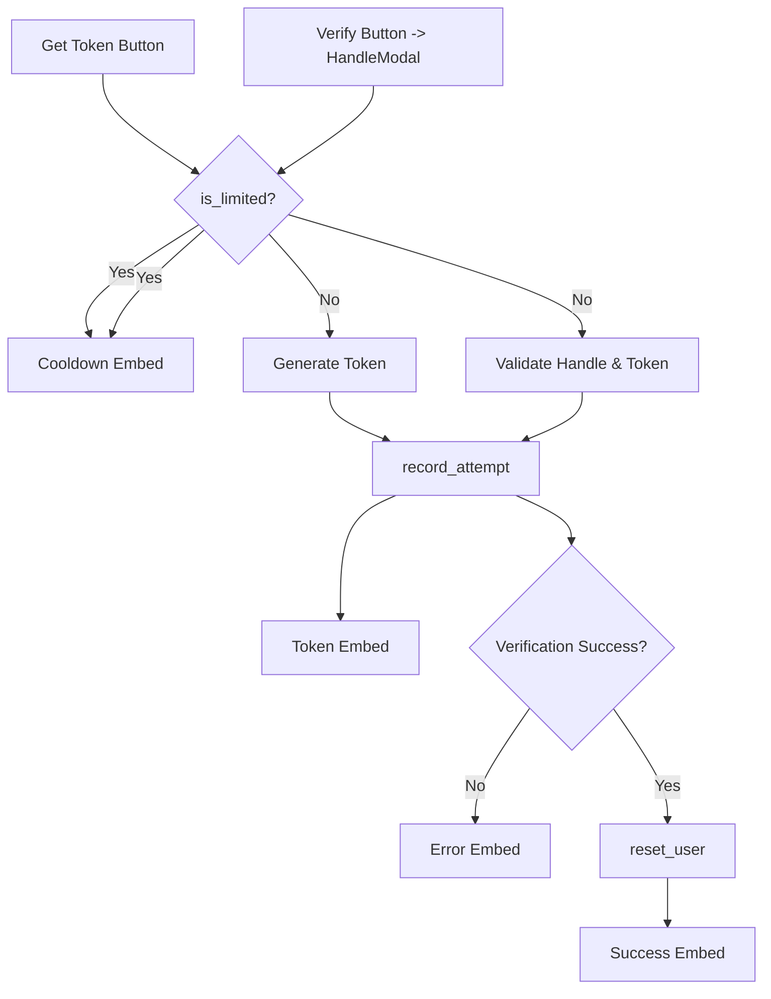

# Unified Rate Limit Refactor Plan

## Goals
- **Shared Limiter**: Both the **Get Token** button and the **Verify/Re-Check** flow should call the same rate-limiter with configurable `max_attempts` and `window_seconds` values.
- **Admin Reset**: Keep `/reset-all` and `/reset-user` working with the new limiter so moderators can clear attempts easily.
- **Unified Messaging**: Send the same cooldown and error embeds regardless of which part of the verification flow the user triggered.

## Implementation Plan

### Affected Files
- `helpers/rate_limiter.py`
- `config/config.yaml`
- `helpers/views.py`
- `helpers/modals.py`
- `cogs/admin.py`
- `tests/` (add or update unit tests)

### Key Changes
1. **rate_limiter.py**
   - Convert the helper functions into a single `RateLimiter` class (e.g., `is_limited`, `record_attempt`, `reset_user`, `reset_all`).
   - The class should load `max_attempts` and `window_seconds` from `config/config.yaml` as is (lines 3–5)【F:config/config.yaml†L3-L5】.
   - Provide a singleton instance used across the bot.

2. **views.py**
   - In `VerificationView.get_token_button_callback` (lines 115–135)【F:helpers/views.py†L115-L135】, replace direct calls to `check_rate_limit` and `log_attempt` with the new class methods.
   - Ensure the cooldown embed from `create_cooldown_embed` (lines 111–128 in `embeds.py`)【F:helpers/embeds.py†L111-L128】 is used for rate limit messages.

3. **modals.py**
   - Update `HandleModal.on_submit` to use the same rate-limiter instance for checking and logging attempts (lines 100–121)【F:helpers/modals.py†L100-L121】.
   - Attempts should be logged immediately after passing the rate limit check to keep counting consistent with the button flow.

4. **admin.py**
   - Update the `/reset-all` and `/reset-user` commands to call the new `RateLimiter.reset_all()` and `RateLimiter.reset_user()` methods (lines 24–67)【F:cogs/admin.py†L24-L67】.

5. **config.yaml**
   - No new keys are required, but document that `rate_limits.max_attempts` and `rate_limits.window_seconds` drive the unified limiter.

6. **tests/**
   - Add tests for the `RateLimiter` class: limit enforcement, cooldown expiry, and reset commands.
   - Update any existing verification tests to use the new interface.

### Logging and Attempt Timing
- Both button presses and modal submissions will call `RateLimiter.record_attempt` after successfully passing `is_limited`. This means attempts are logged earlier for the verification modal than before. The workflow diagram below reflects the change.
- Existing in-memory data (`user_verification_attempts`) will be cleared on deploy; no migration needed, but note in release notes that counters reset when updating.

## Mermaid Diagram

