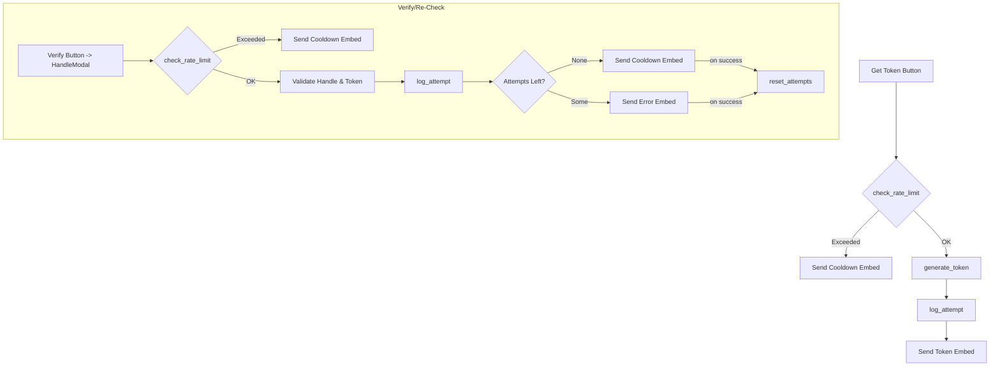

# Unifying Rate Limit Workflow

This document summarizes how rate limiting currently works for the **Get Token** and **Verify/Re‑Check** flows. It also notes where the logic is implemented and potential considerations for unifying these processes.

## Existing Flow Overview

### Get Token Flow
1. User presses **Get Token** in `VerificationView`.
2. `helpers/views.py` [`get_token_button_callback`](../../helpers/views.py#L116-L137) checks the rate limit using `check_rate_limit`.
3. If over the limit, a cooldown embed is sent and the action stops.
4. Otherwise, `generate_token` creates a new token and `log_attempt` records the attempt.
5. The user receives an ephemeral embed with the token and expiry time.

### Re‑Check / Verify Flow
1. User presses **Verify** (or Re‑Check) which opens `HandleModal`.
2. `helpers/views.py` [`verify_button_callback`](../../helpers/views.py#L142-L157) again checks the rate limit. If exceeded, a cooldown embed is shown.
3. In `helpers/modals.py` [`HandleModal.on_submit`](../../helpers/modals.py#L42-L130) the RSI handle and token are validated.
4. `log_attempt` is called after token validation, and `get_remaining_attempts` determines if the user should see an error or cooldown message.
5. On success, `reset_attempts` clears the rate‑limit counter for that user.

## Where Rate Limits Are Tracked
- **Helper Module:** `helpers/rate_limiter.py`
  - In‑memory map `user_verification_attempts` tracks `{user_id: {count, first_attempt}}`【F:helpers/rate_limiter.py†L17-L19】.
  - Functions `check_rate_limit`, `log_attempt`, `get_remaining_attempts`, `reset_attempts` implement the logic【F:helpers/rate_limiter.py†L21-L120】.
- **Configuration:** `config/config.yaml` defines:
  - `rate_limits.max_attempts` and `rate_limits.window_seconds`【F:config/config.yaml†L3-L5】.
- **Admin Reset:** `cogs/admin.py` exposes `/reset-all` and `/reset-user` which call `reset_all_attempts` or `reset_attempts` respectively【F:cogs/admin.py†L32-L67】.
- **Cooldown Messages:** `helpers/embeds.py` provides `create_cooldown_embed` shown when limits are hit【F:helpers/embeds.py†L108-L124】.

Currently, attempts are only stored in memory. A bot restart clears all counters.

## Mermaid Diagram

## Potential Edge Cases for Unification
- **State Reset:** Since rate limits are in-memory, moving to a shared limiter may require migrating data or accepting a clean slate on deploy.
- **Different Logging Points:** Get Token logs immediately, while HandleModal logs after token validation; unifying may change how attempts are counted.
- **Admin Tools:** Slash commands rely on `reset_*` helpers—these should continue to function after refactor.

Unifying both flows to a single, config-driven limiter should simplify cooldown messaging and make admin reset commands apply consistently.
