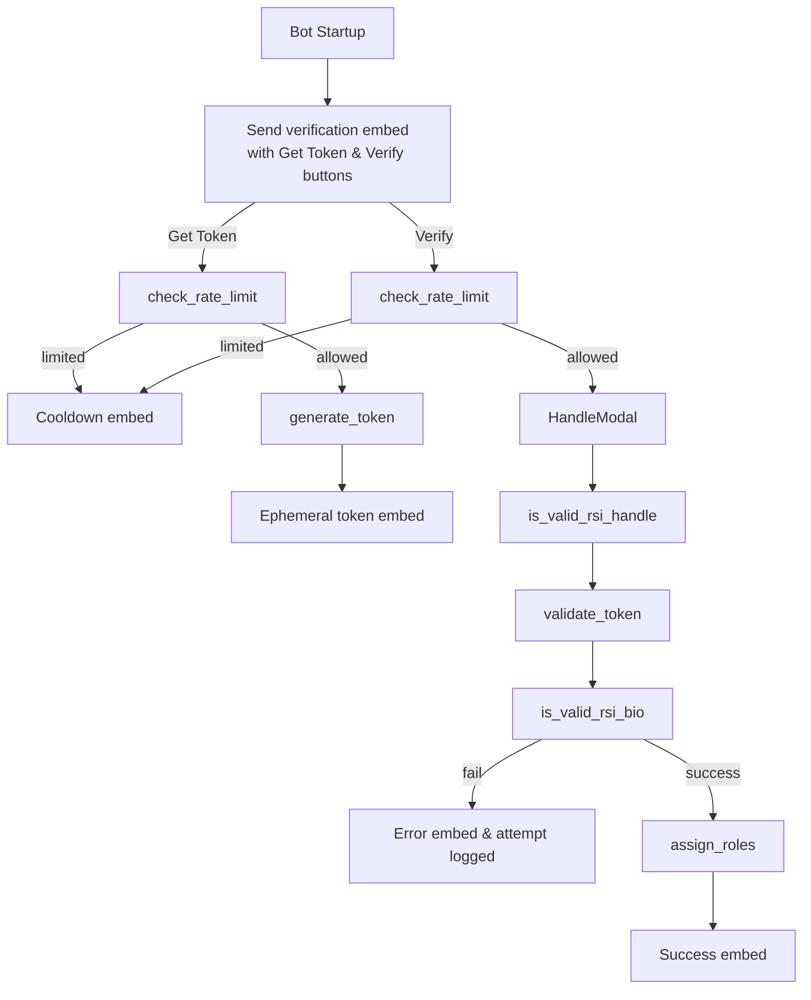

# Verification Workflow

This document describes how the bot verifies users based on their RSI (Star Citizen) profile.
It also highlights where a future **Re‑Check** feature would integrate.

## Overview
- **Channel Message**: On startup the bot sends a verification embed to the configured channel. This embed contains the `Get Token` and `Verify` buttons ([`VerificationView`](../helpers/views.py)).
- **Token Generation**: Selecting **Get Token** checks the rate limit and, if allowed, generates a 4‑digit PIN using [`generate_token`](../helpers/token_manager.py). The PIN expires after 15 minutes and is shown in an ephemeral embed ([`create_token_embed`](../helpers/embeds.py)).
- **Handle Submission**: Selecting **Verify** opens [`HandleModal`](../helpers/modals.py) where the user enters their RSI handle. The modal validates:
  1. RSI handle format.
  2. Membership in the TEST organization via [`is_valid_rsi_handle`](../verification/rsi_verification.py).
  3. That a valid token exists and is present in the user’s RSI bio via [`is_valid_rsi_bio`](../verification/rsi_verification.py).
- **Role Assignment**: If checks succeed, [`assign_roles`](../helpers/role_helper.py) grants `BotVerified` plus the appropriate org role (Main/Affiliate/Non‑Member). Verification attempts and tokens are cleared.
- **Rate Limiting**: All verification actions are limited by [`check_rate_limit`](../helpers/rate_limiter.py). Exceeding the limit sends a cooldown embed.

## Where Re‑Check Fits
A future **Re‑Check** action could reuse the HandleModal logic to update roles for users who are already verified. It would trigger the same validations as **Verify** but skip token generation, allowing members to refresh their status.

## Mermaid Diagram

