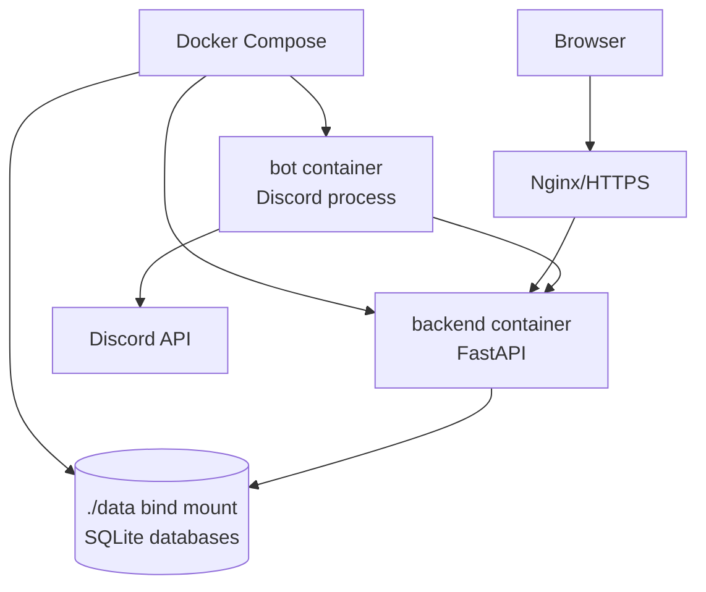

# Deployment

```mermaid
flowchart TB
  Compose[Docker Compose]
  Compose --> Backend[backend container\nFastAPI]
  Compose --> Bot[bot container\nDiscord process]
  Compose --> Data[(./data bind mount\nSQLite databases)]
  Browser[Browser] --> Nginx[Nginx/HTTPS]
  Nginx --> Backend
  Backend --> Data
  Bot --> Backend
  Bot --> Discord[Discord API]
```

Docker Compose is the canonical deployment path. The data bind mount must be
backed up before upgrades or destructive maintenance.
