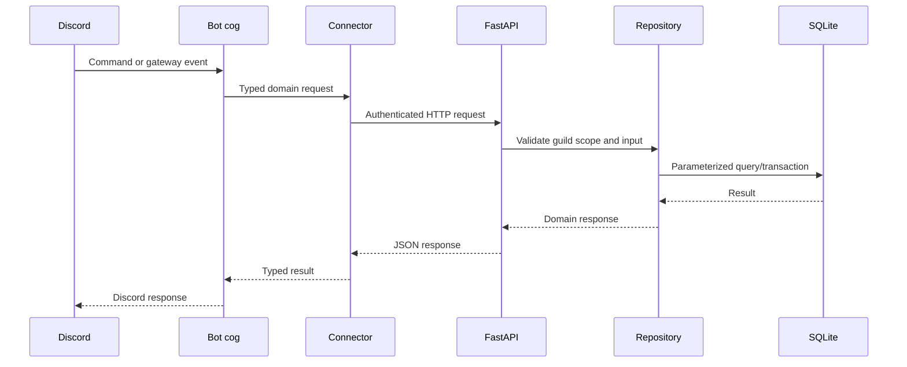

# Request and Event Flow

```mermaid
sequenceDiagram
  participant D as Discord
  participant B as Bot cog
  participant C as Connector
  participant A as FastAPI
  participant R as Repository
  participant S as SQLite
  D->>B: Command or gateway event
  B->>C: Typed domain request
  C->>A: Authenticated HTTP request
  A->>R: Validate guild scope and input
  R->>S: Parameterized query/transaction
  S-->>R: Result
  R-->>A: Domain response
  A-->>C: JSON response
  C-->>B: Typed result
  B-->>D: Discord response
```
