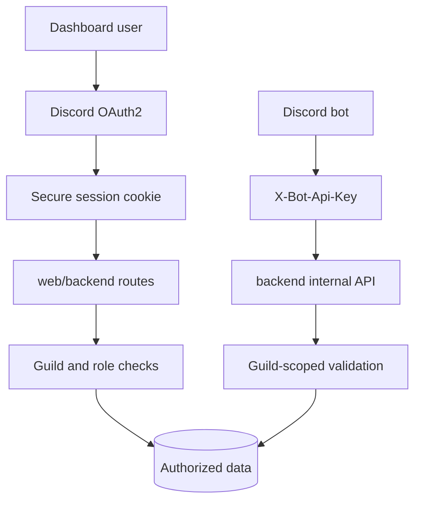

# Security and Authentication

```mermaid
flowchart TD
  User[Dashboard user] --> OAuth[Discord OAuth2]
  OAuth --> Session[Secure session cookie]
  Session --> WebRoutes[web/backend routes]
  Bot[Discord bot] --> Key[X-Bot-Api-Key]
  Key --> Internal[backend internal API]
  WebRoutes --> Permissions[Guild and role checks]
  Internal --> GuildScope[Guild-scoped validation]
  Permissions --> Data[(Authorized data)]
  GuildScope --> Data
```

Never place tokens, session values, or private user payloads in logs or issue
reports. Keep the bot API key boundary intact when adding internal routes.
