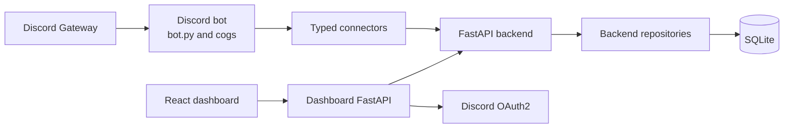

# System Overview

The backend is the authoritative data and API boundary. New guild-scoped data
access belongs in `backend/db/repository/`; bot code accesses it through
`connectors/` and the dashboard uses its existing backend routes.
